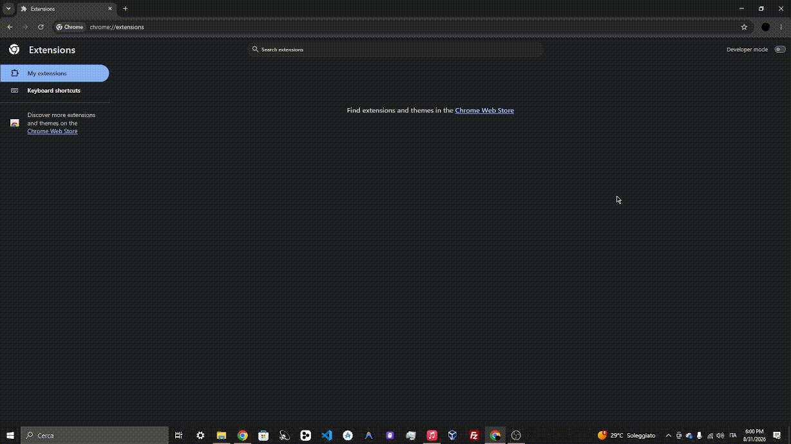
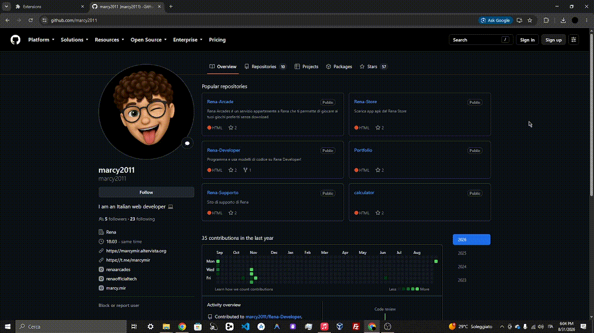

# Chrome Tab Screen Recorder

A simple Chrome extension that allows you to record the screen of the current Chrome tab with just one click.

Click the extension to start recording. Click it again to stop the recording and automatically download the video.

## Features

- Record the current Chrome tab
- Start recording with one click
- Stop recording with one click
- Automatically download the recording when stopped
- No account or login required

## Installation

> **Note:** This extension is not available on the Chrome Web Store. You can download it from the **Releases** section of this GitHub repository.

### 1. Download the Extension

Go to the [Releases](https://github.com/marcy2011/Chrome-Screen-Recorder/releases/tag/Release) section and download the latest version.

You can choose between:

- `.zip` — install using **Load unpacked** (you'll need to extract it)
- `.crx` — packaged Chrome extension (you'll need to zip it and then extract it)

### 2. Extract the ZIP

If you downloaded the `.zip` version, extract it to a folder on your computer.

### 3. Open Chrome Extensions

Open Chrome and navigate to `chrome://extensions/`.

### 4. Enable Developer Mode

Enable **Developer mode** using the switch in the top-right corner.

### 5. Load the Extension

Click **Load unpacked**.

Select the folder containing the extracted extension files.

The extension is now installed.

## Installing the CRX Version

If you downloaded the `.crx` version:

1. Open `chrome://extensions/`
2. Enable **Developer mode**
3. Drag and drop the `.crx` file onto the Chrome extensions page

> **Note:** Some Chrome versions may restrict installation from `.crx` files. If the CRX installation does not work, use the ZIP version and install it using **Load unpacked**.

## How to Use

Using the extension is very simple.

### Start Recording

Click the extension icon in the Chrome toolbar.

The recording starts immediately.

### Stop Recording

Click the extension icon again.

The recording stops immediately.

### Download the Recording

Once the recording stops, the video is automatically downloaded to your computer.

## Releases

All versions of the extension are available in the [Releases](https://github.com/marcy2011/Chrome-Screen-Recorder/releases/tag/Release) section.

Each release may include:

| File | Description |
| --- | --- |
| `.zip` | Extension files for installation using **Load unpacked** |
| `.crx` | Packaged Chrome extension |

It is recommended to use the latest release.

Then:

1. Open `chrome://extensions/`
2. Enable **Developer mode**
3. Click **Load unpacked**
4. Select the cloned repository folder

## Privacy

The extension is designed to work locally in your browser.

Recordings are not uploaded to an external server by the extension.

The recorded video is saved directly to your computer when the recording is stopped.
